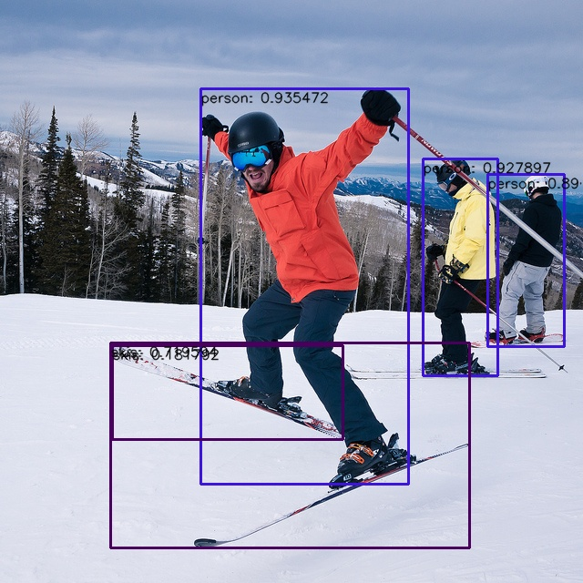

# Model_Zoo
## Description
Model Zoo is developed based on the YLANN SDK toolchain and provides deployment examples for current mainstream algorithms. 
Include the process of exporting the YLANN model and using Python API and CAPI to infer the YLANN model.

<ul>
<li>Support Yulong810A, Yulong810C platforms.</li>
<li>Limited support Yulong410SE, Yulong810E platforms.</li>
</ul>

## Dependency library installation
Model Zoo relies on Toolkit for model conversion. The Linux compilation tool chain is required when compiling the Linux demo. 
## Model support
In addition to exporting the model from the corresponding respository.

|     Category     |     Name     |   Dtype   |                                       Model Download Link                                        | Support platform |
|:----------------:|:------------:|:---------:|:------------------------------------------------------------------------------------------------:|:----------------:|
|  Classification  | resnet_v1_50 | FP16/INT8 | [resnet_v1_50](https://github.com/Zhaonb/orbita_model_zoo/tree/main/examples/resnet_v1_50/model) |    Yulong810A    |
| Object Detection |   yolov5s    | FP16/INT8 |      [yolov5s](https://github.com/Zhaonb/orbita_model_zoo/tree/main/examples/yolov5s/model)      |    Yulong810A    |
| Object Detection |   yolov8s    | FP16/INT8 |               [yolov8s](https://pan.baidu.com/s/1ATmP4T9veiUCL_OG8nmnyA?pwd=r284)                |    Yulong810A    |
| Object Detection |   yolov10s   | FP16/INT8 |               [yolov10s](https://pan.baidu.com/s/1ATmP4T9veiUCL_OG8nmnyA?pwd=r284)               |    Yulong810A    |
| Object Detection |   yolov12n   | FP16/INT8 |               [yolov12n](https://pan.baidu.com/s/1ATmP4T9veiUCL_OG8nmnyA?pwd=r284)               |    Yulong810A    |

## Model performance benchmark(FPS)

|       demo       |   model_name    | inputs_shape     | inputs_shape | dtype | Yulong810A |
|:----------------:|:---------------:|------------------|:------------:|:-----:|:----------:|
|  Classification  |  resnet_v1_50   | [1, 3, 224, 224] |  FP16/INT8   | INT8  |   111.11   |
|  Classification  | bvlc_googlenet  | [1, 3, 224, 224] |  FP16/INT8   | INT8  |    250     |
| Object Detection | pva_faster_rcnn | [1, 3, 640, 640] |  FP16/INT8   | INT8  |   58.82    |
| Object Detection |   faster_rcnn   | [1, 3, 640, 640] |  FP16/INT8   | INT8  |   10.98    |
| Object Detection |   yolov3_relu   | [1, 3, 640, 640] |  FP16/INT8   | INT8  |   52.63    |
| Object Detection |     yolov5s     | [1, 3, 640, 640] |  FP16/INT8   | INT8  |   35.71    |
| Object Detection |     yolov6      | [1, 3, 640, 640] |  FP16/INT8   | INT8  |   35.71    |
| Object Detection |     yolov7      | [1, 3, 640, 640] |  FP16/INT8   | INT8  |    9.01    |
| Object Detection |     yolov8n     | [1, 3, 640, 640] |  FP16/INT8   | INT8  |   38.46    |
| Object Detection |     yolov8s     | [1, 3, 640, 640] |  FP16/INT8   | INT8  |   20.83    |
| Object Detection |    yolov10s     | [1, 3, 640, 640] |  FP16/INT8   | INT8  |   18.18    |
| Object Detection |     yolo11s     | [1, 3, 640, 640] |  FP16/INT8   | INT8  |   18.18    |


<ul>
<li>This performance data are collected based on the maximum NPU frequency of each platform.</li>
<li>This performance data calculate the time-consuming of model inference. Does not include the time-consuming of pre-processing and post-processing if not specified.</li>
</ul>

## Make & Run Demo
For Linux Yulong810A develop board:

```bash
# Make YOLOv10s detection from the command line
$ cd ~/root/workspace/01_Detection/yolov10s_shape_slim_uint8  # Adjust model  as needed
$ make
# Run YOLOv10s detection from the command line
$ sh run.sh
```

</p></center>

## Release Notes

| Version |         Description          |
|:-------:|:----------------------------:|
|  1.0.0  | Yolo detection demo release. |

## NPU Resource

| Version    | Description                                              | Passwd |
|:-----------|:---------------------------------------------------------|--------|
| Yulong810A | https://pan.baidu.com/s/1tOSytyp5UTcehBjmIfTU0w?pwd=pwux | pwux   |
| YLANNTools | https://pan.baidu.com/s/1D49hZQZYKiZzqp90Ey0_2w?pwd=tryx | tryx   |

## License
[Apache License 2.0](https://github.com/Zhaonb/orbita_model_zoo/blob/main/LICENSE) 

