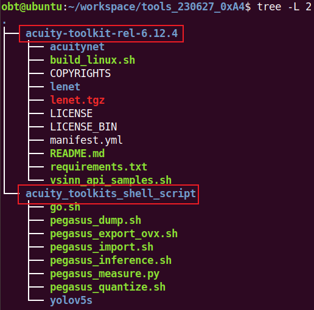

# Working with the ACUITY Toolkit
This chapter describes the toolkit installation and usages of different tools in detail.

## Installing ACUITY Binary Version
This task installs the binary package of the ACUITY Toolkit.

### About This Task
The ACUITY Toolkit provides both binary and Python versions. Use the binary version only in a binary working environment. For development and Python releases, use the Python version instead.

### Prerequisites 

  - Ubuntu 20.04 with Python 3.8, Ubuntu 18.04 with Python 3.6, or Ubuntu 16.04 with Python 3.5 is set up.
  - The YLANNIDE is installed correctly if you want to generate NBG cases from the ACUITY Toolkit.
  - For details about YLANNIDE, see YLANNIDE User Guide, provided in the release package.

### Procedure
1. Extract the ACUITY package, Verisilicon_Tool_Acuity_Toolkit_`<version>`.tgz, to a destination directory.
2. From this directory, locate and unpack the binary package acuity-toolkit-binary-`<version>`. When the unpacking completes, the installation finishes.
3. Extract the shell package, acuity_toolkits_shell_script.tar.gz, to the same destination directory

  

### What to Do Next
1. Switch to the ./acuity-toolkit-binary-`<version>`/bin directory.
2. Set the environment variable ACUITY_PATH as follows: export ACUITY_PATH=<directory of acuity-toolkit-binary-version>/bin
3. Execute the ACUITY binary tools to perform model translations, optimizations, and deployments.
