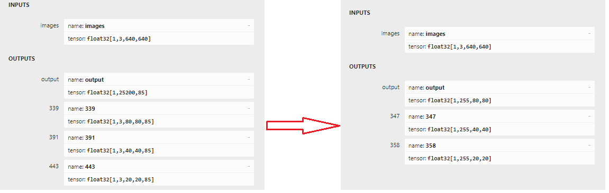
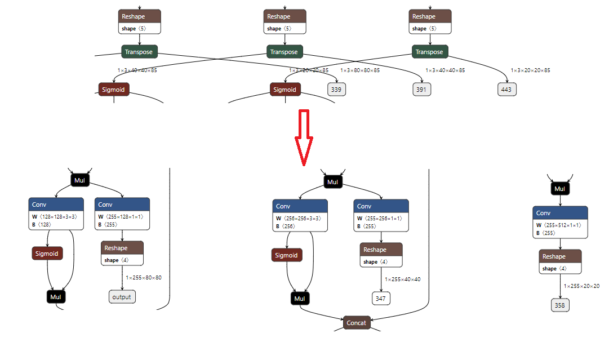

## 1. Description

The model used in this example comes from the following open source projects:  

https://github.com/ultralytics/yolov5

## 2. Current Support Platform

Yulong810A, Yulong810C
## 3. Pretrained Model

Download link: 

[./yolov5s.onnx](https://github.com/Zhaonb/orbita_model_zoo/blob/main/examples/yolov5s/model/yolov5s.onnx)   
**Note**: The model provided here is an optimized model, which is different from the official original model. Take yolov5n.onnx as an example to show the difference between them.

1. The comparison of their output information is as follows. The left is the official original model, and the right is the optimized model.

  

2. Taking the output change [1,25200,85]->[1,255,80,80] as an example, we delete a subgraph (the framed part in the picture) from the model and put it in post-processing (this subgraph is not quantification-friendly)

  

